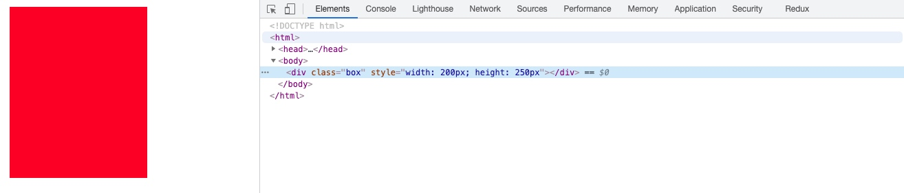

# css 盒模型


## 基础知识
```css
<!--标准模式-->
box-sizing: content-box;

<!--怪异模式（又称IE模式）-->
box-sizing: border-box;
```
## 考点
### 1. 标准模型和IE模型的区别
```css
<!--
    预设：
        width: 200px;
        height: 200px;
        padding: 20px;
        border: 10px solid red;
        margin: 30px;
        background: red;
-->
```
标准模式: 占用width = 260, 其中 20（padding） * 2 + 10(border) * 2, 内容区： 200

怪异模式: 占用width = 200, 其中 20（padding）* 2 + 10(border) * 2， 内容区：140

### 2. js如何设置获取盒模型对应的宽和高
- dom.style.width/height 只能取到行内样式的宽和高，style标签中和link外链的样式取不到。




- window.getComputedStyle(dom).width/height 同（2）但是多浏览器支持，IE9以上支持。


- dom.getBoundingClientRect().width/height 也是得到渲染后的宽和高，大多浏览器支持。IE9以上支持，除此外还可以取到相对于视窗的上下左右的距离。


反思：在动态生成骨架屏的过程中，可以参考如上 API 分析页面元素位置。