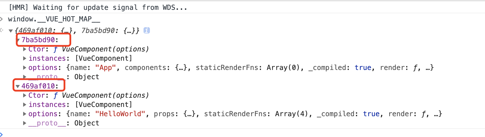

# Vue-Loader Hot Reload

### Hot Reload 触发时机

```javascript
const needsHotReload = (
    !isServer &&
    !isProduction &&
    (descriptor.script || descriptor.template) &&
    options.hotReload !== false
)
```

* **isServer**  判断当前是浏览器环境还是Node环境；
* **isProduction** 判断只有是开发环境才进行HMR；
* **descriptor** 对象从 **@vue/component-compiler-utils** 提供的 **parse** 函数处理所得。
* **options** 从 **loader-utils** 返回值中所得。

### Loader-utils


**loader-utils** 本身是**webpack**提供的插理解是**webpack**本身提供的一些工具方法。


不难看出，**loaderUtils.getOptions** 方法本质是序列化 **webpack** 运行时的上下文。

### vue-hot-reload-api 

#### 调用链路分析


通过 Debug 可以宏观意义上的去体会 **vue-hot-reload-api** 提供的能力。


#### 钩子 API 汇总

| 名称 | 类型 | 作用 |
| :--- | :--- | :--- |
| compatible | Boolen | vue-hot-reload-api 只作用于 vue 2.x 版本 |
| createRecord | Function | 以模块ID为key， |
| install | Function | 将 vue 注册到 vue-hot-reload-api  |
| isRecorded | Function | 判断当前修改的文件是否曾经被修改过 |
| reload | Function | 组件重新加载options |
| rerender | Function | 修改后的components 重新 render |

#### 实现存储

```javascript
const map = Object.create(null)
if (typeof window !== 'undefined') {
  window.__VUE_HOT_MAP__ = map
}
```

源码中，hot-reload 会缓存在一个对象中。并且对外暴露了更新组件时对象内部的结构。如下如所示：



### 答疑解惑

#### 1. module.hot.accept 做了什么？

```javascript
// dep: ./src/components/HelloWorld.vue?vue&type=template&id=469af010&scoped=true&
const hot = {
	_acceptedDependencies: {}
}
function(dep, callback) {
	if (dep === undefined) {
		hot._selfAccepted = true;
	}
	else if (typeof dep === "function") {
		hot._selfAccepted = dep;
	}
	else if (typeof dep === "object") {
		for (var i = 0; i < dep.length; i++) {
			hot._acceptedDependencies[dep[i]] = callback || function() {};
		}
	}
	else {
		hot._acceptedDependencies[dep] = callback || function() {};
	}
},
```

从上面代码中可以体会到，\*.vue 一旦发生改变，vue文件在这里是被看成是 module 。module.hot.accept 只是单方面去存储每一次 \*.vue 文件的修改的回调函数。试想，当同一个文件被多次修改后，最后一次修改完成后的内容，才对我们有意义。所以当一次 HMR 过程中，vue 会将文件的请求路径作为KEY，对应修改的 render 回调函数作为 value 。

#### 3. vue-hot-reload-api rerender 做了什么？


rerender 底层是区分 function 组件或者是  options 组件的，阅读代码可知，当我们修改一个文件的时候，如果这个组件是没有options的话，意味着这个组件是一个纯静态的UI组件。那么我们修改 template 中的文案时，只需要通知到相应的组件，进行 forceUpdate 就可以了。当存在options 时候，就需要我们覆盖重置组件内的options，并且执行 forceUpdate。

### 总结：

webpack + vue-loader 提供了解析模板的能力，在开发阶段，帮我们顺利定位到了我们修改的是那个组件，并且完美的解析了我们修改的组件形成DSL。那么推动vue组件重新渲染的，是 vue 中 forceUpdate 的功劳。


