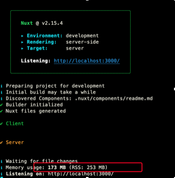
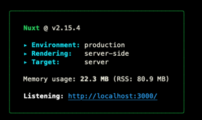
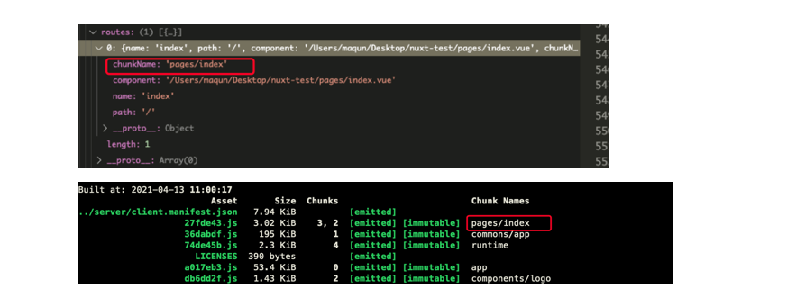

# Nuxt 源码体悟

## 模式

`Nuxt` 或者是 `Next` 都提供了三种模式，借此梳理了一下。

<table>
  <thead>
    <tr>
      <th style="text-align:left">&#x540D;&#x79F0;</th>
      <th style="text-align:left">&#x4F18;&#x70B9;</th>
      <th style="text-align:left">&#x7F3A;&#x70B9;</th>
    </tr>
  </thead>
  <tbody>
    <tr>
      <td style="text-align:left">SPA</td>
      <td style="text-align:left">
        <p>1. Javascript Framework(vue/react/rn)&#x7B80;&#x5316;&#x9AD8;&#x5EA6;&#x6570;&#x636E;&#x6570;&#x636E;&#x7ED1;&#x5B9A;&#xFF0C;&#x7B80;&#x5316;&#x4EA4;&#x4E92;&#x5F0F;&#x5E94;&#x7528;&#x7A0B;&#x5E8F;&#x7684;&#x5F00;&#x53D1;&#x3002;</p>
        <p>2. &#x4E00;&#x6B21;&#x8BF7;&#x6C42;&#xFF0C;&#x540E;&#x9762;&#x4E0D;&#x9700;&#x8981;&#x5728;&#x91CD;&#x590D;&#x8BF7;&#x6C42;&#x8D44;&#x6E90;&#x3002;</p>
        <p>3. SPA &#x901A;&#x8FC7; API &#x63A8;&#x52A8;&#x6570;&#x636E;&#x4E0E;&#x5C55;&#x793A;&#x5C42;&#x7684;&#x5206;&#x79BB;&#x3002;</p>
      </td>
      <td style="text-align:left">
        <p>1. &#x5305;&#x4F53;&#x79EF;&#x8FC7;&#x5927;&#x3002;</p>
        <p>2. &#x4E0D;&#x80FD;&#x5F88;&#x597D;&#x7684;SEO&#x3002;</p>
        <p>3. &#x5E94;&#x7528;&#x72B6;&#x7531;&#x4E8E;&#x90FD;&#x5B58;&#x653E;&#x5230;&#x5185;&#x5B58;&#x4E2D;&#xFF0C;&#x5927;&#x578B;&#x5E94;&#x7528;&#x72B6;&#x6001;&#x590D;&#x6742;&#x5EA6;&#x8F83;&#x9AD8;&#x3002;</p>
      </td>
    </tr>
    <tr>
      <td style="text-align:left">SSG</td>
      <td style="text-align:left">
        <p>1. &#x66F4;&#x597D;&#x7684;SEO</p>
        <p>2. &#x51CF;&#x5C11;LCP&#x7684;&#x8017;&#x65F6;&#x3002;</p>
      </td>
      <td style="text-align:left">
        <p>1. &#x5185;&#x5BB9;&#x66F4;&#x65B0;&#x4E0D;&#x53CA;&#x65F6;&#x3002;</p>
        <p>2. &#x5B9A;&#x5236;&#x7C7B;&#x5BA2;&#x6237;&#x9700;&#x6C42;&#x53D8;&#x5F97;&#x590D;&#x6742;&#x3002;</p>
      </td>
    </tr>
    <tr>
      <td style="text-align:left">SSR</td>
      <td style="text-align:left">
        <p>1. &#x51CF;&#x5C11;LCP&#x7684;&#x8017;&#x65F6;</p>
        <p>2. &#x5185;&#x5BB9;&#x66F4;&#x65B0;&#x53CA;&#x65F6;</p>
      </td>
      <td style="text-align:left">
        <p>1. &#x5E26;&#x6765;&#x670D;&#x52A1;&#x5668;&#x8FD0;&#x7EF4;&#x6210;&#x672C;&#x3002;</p>
        <p>2. JS&#x591A;&#x73AF;&#x5883;&#x8FD0;&#x884C;&#x5BF9;&#x5F00;&#x53D1;&#x8005;&#x5168;&#x5C40;&#x53D8;&#x91CF;&#x4F7F;&#x7528;&#x6709;&#x8981;&#x6C42;&#x3002;</p>
      </td>
    </tr>
  </tbody>
</table>

## 为什么选择Nuxt?

SSR 旨在用户请求访达时，首屏页面真实 DOM 早已从前端 Javascript Framework 中编译解析出来。从而浏览器渲染进程在渲染页面的时候，区别于 SPA, 不依赖 Javascript 解析。从而减少 LCP 的耗时。

但是，当用户行为的注册、监听的时间，比如用户点击行为。还是依赖 js 。而且，SSR 服务端渲染出页面后，页面如何进行跳转。同样是开发者需要考虑的问题。

开发部署阶段编译 → 路由表匹配模板 → 编译模板 + 打包工具输出JS → 生成页面返回 → http 用户请求 → koa 等server 拦截请求 → 路由表匹配模板 → 动态加载js

以上是 Nuxt SSR模式下的主要流程。为什么选择Nuxt，在我看来，他提供了一种方便，方便开发者在不考虑内部机制的情况下，快速实现APP应用的SSR模式。所以，他的SSR模式是主打功能，相对于SPA，个人觉得框架本身它的侧重点不在与此。

## Nuxt 编译阶段线性工作流

Nuxt 源码中，基类 Nuxt 继承一个NPM包，[Hable](https://www.npmjs.com/package/hable)。它贯穿整个 Nuxt 编译阶段的生命周期。Nuxt 官网中也有描述，它主要的功能对标 Webpack [Tapable](https://www.npmjs.com/package/tapable)。内部源码实现很好理解，一共不到200行代码。如图：  

这里我浓缩了一下，代码如下：

```javascript
const cache = {};
function hook (name, fn) {
    if (!cache[name]) {
        cache[name] = [fn];
    } else {
        cache[name].push(fn);
    }
    return () => {
        if (fn) {
            console.log("==remove==");
        }
    }
} 
// 方法调用
hook('test1', () => {
    console.log("====待调用方法===");
})
hook('test2', () => {
    console.log("====待调用方法===");
})
```

```javascript
// 内部对 cache 缓存的方法进行顺序执行
function serial(task, fn) {
    return tasks.reduce((promise, task) => promise.then(() => fn(task)), Promise.resolve(null))
}
```

使用这样一个库的意义是保证 Nuxt 在编译阶段，各个部分都可以按照调用顺序执行，并且保证每一次的方法执行都基于上一次 Promise 的执行完成之后，从而形成编译阶段的线性工作流。

## Nuxt Server

Nuxt 本身提供三种启动方式。开发阶段本身的诉求就是，高效的HMR，项目实时预览。那么在Nuxt中，底层是用了 Webpack 作为开发编译阶段的工具。如下图对比可以所示：

 

第一张图运行时内存占用较大，是因为webpack在动态编译js时候，会把编译所形成的DSL存储在内存当中，方便模板修改后，对 DSL 的 diff。而第二张图，代表着 Nuxt 提供的生产模式下的 server 启动方式。其本质基于 Node HTTP + [Connect](https://www.npmjs.com/package/connect) 模块结合。

## Nuxt 各阶段梳理

### 1. 开发部署阶段编译

Nuxt 基于vue，所以在编模板时，理所应当的利用了`vue-template-complier` 以及 `vue-loader` 对文件进行编译。同时，vue 提供了 SSR 模式的 `renderToString()`将模板转换成这是 DOM 字符串。

### 2. 打包工具输出js

Nuxt 本身提供 Webpack + vue-loader 对模板进行编译、切割、解释、生成压缩文件。作为开发者，也可以结合自身去动完成。

### 3. 生成页面返回

`VueRender.renderer` 包含 \( `SpaRender` + `SsrRender` \)，两种模式被不通的Render方法所处理，处理过程中，结合 Nuxt.config.js 配置。生成完成的html字符串。输出到html中。


### 4. 路由表匹配实现页面切换

Nuxt 实现页面切换，主要是在编译解析路由的过程中，会生成不同的chunkName。chunkName 本身是和编译后的JS存在对应关系。所以当页面路由发生变化。Nuxt 会动态匹配并完成JS执行。



