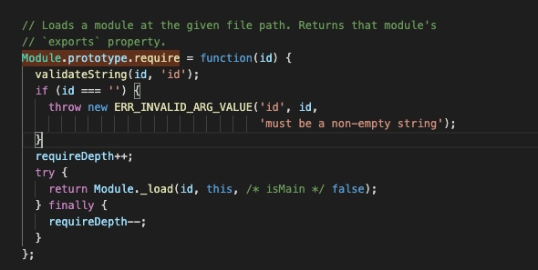
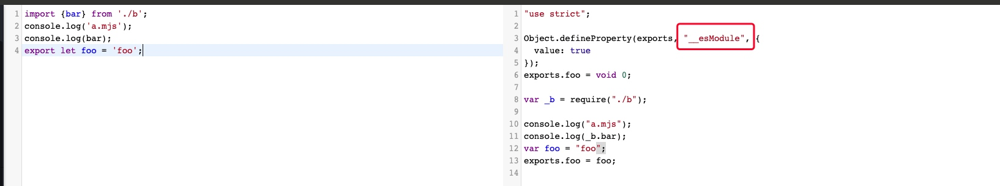
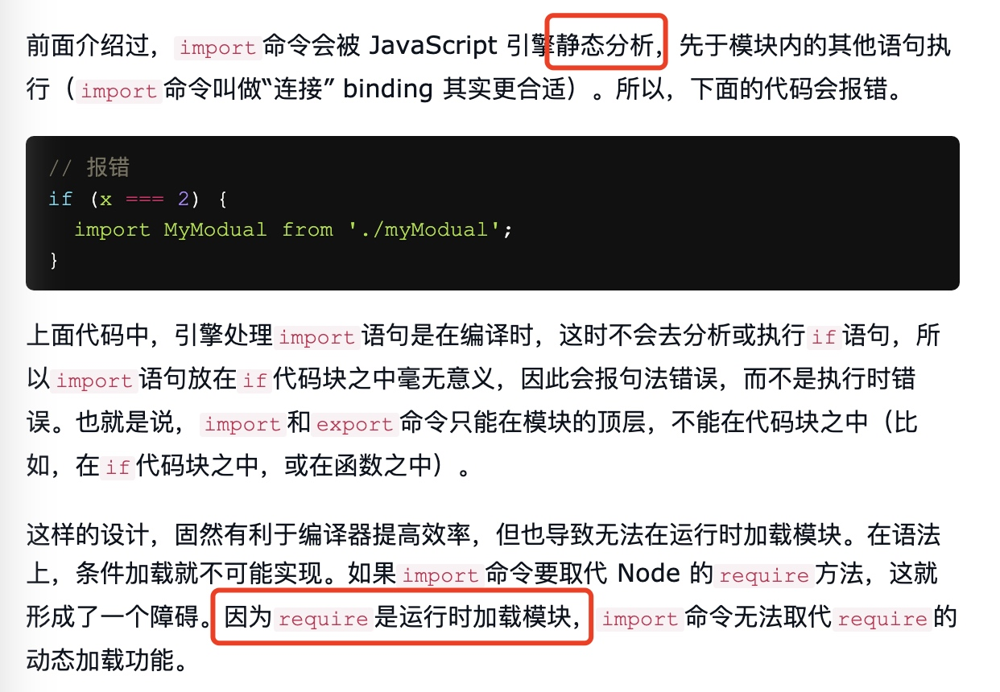

# Node 模块加载

```javascript
const http = require('http');
```

## 传送门
https://github.com/nodejs/node/blob/master/lib/internal/modules/cjs/loader.js

## 解读

### 模块检索

- node作为js的运行环境，当你执行 `require` 的时候，采用回溯算法加载所有的模块。
- requireDepth作为查找树深度。
- 根据模块名称加载模块。

```javascript
// request ===> 模块加载的名称，例如：http
// parent ===> Module的执行上下文Context
// isMain ===> 判断是否是内置的系统模块
Module._load = function(request, parent, isMain) {}
```

- Node 加载模块第一次会把加载好的模块进行缓存
- 模块分三种：缓存模块、本地第三方模块、内置全局模块

### import & require


如图所示：
- es6 import 的提供，可以理解为一种规范。底层依旧是通过require来实现的。
- import 在转换的过程中。添加了一个业内默认的标识： `__esModule`。
- 内部代码采用严格模式：`"use strict"`。

#### 为什么import只能放到文件头部？
举例：
```javascript
// 执行异常
function test () {
    import bar from './b.mjs';
    console.log(bar);
}
```


个人总结：
- `import` 与 `require` 最大的区别就是一个发生在运行时阶段，一个发生在编译阶段。
- `import` 的出现是为了更好的提升静态语法分析，提升编译阶段的性能。
- 如果提前将 `import` 编译后，是可以放到 function 内部的，所以import不允许在函数内部放置是偏约定性的，并不是绝对的。


